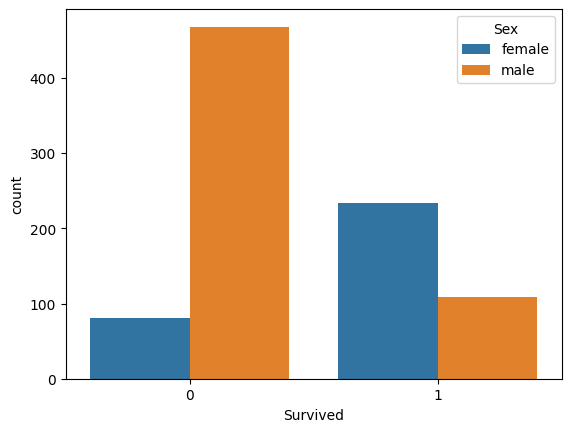

📌 Project Overview

Performing Exploratory Data Analysis (EDA) on the Titanic dataset to uncover survival trends and patterns.

📂 Dataset

Source: Kaggle - Titanic: Machine Learning from Disaster

Size: 891 rows × 12 columns

🔍 Steps Performed

✔ Data Cleaning & Handling Missing Values
✔ Univariate & Bivariate Analysis
✔ Survival Analysis by Gender, Class, Age, and Embarkation
✔ Correlation Heatmap
✔ Visualizations with Matplotlib & Seaborn

📊 Key Insights

✔ Females survived more than males
✔ 1st Class passengers had the highest survival rate
✔ Children (Age < 10) had a better chance of survival
✔ Fare had a positive impact on survival
✔ Smaller families had higher survival chances

📈 Visualizations

(Upload your charts here with Markdown image tags)
Example:

🛠 Tools & Technologies

Python

Pandas, NumPy

Matplotlib, Seaborn

🚀 Future Work

Feature Engineering (FamilySize, Titles)

Predictive Modeling (Logistic Regression, Random Forest)

Hyperparameter Tuning

Thank-YOU ❤️

